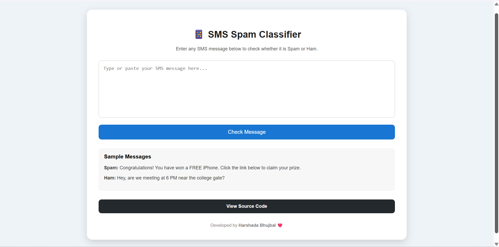
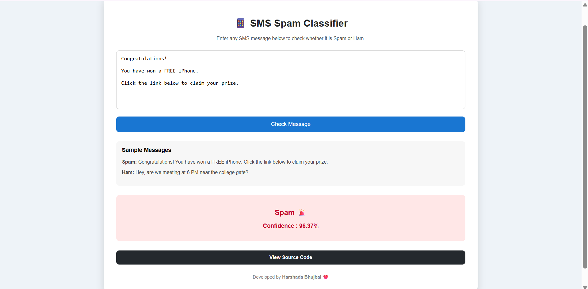
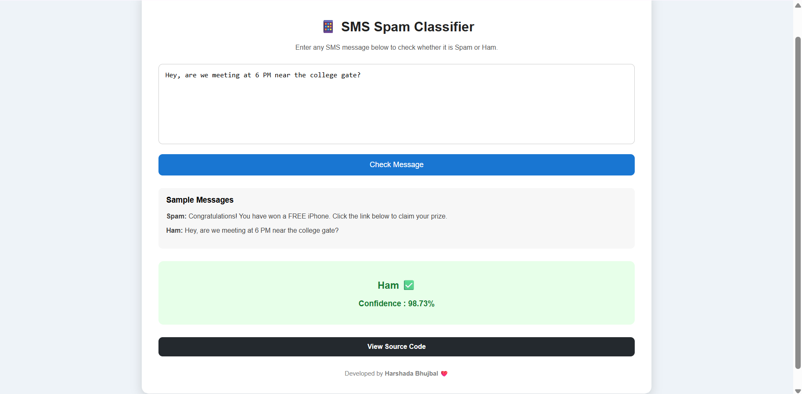

# 📱 SMS Spam Classifier

An end-to-end Machine Learning web application that classifies SMS messages as **Spam** or **Ham (Not Spam)** using Natural Language Processing (NLP) techniques and a Multinomial Naive Bayes classifier.

The project includes data exploration, text preprocessing, model training, evaluation, and a Flask-based web application for real-time predictions.

---

## 🚀 Features

- SMS Spam Detection
- Text Preprocessing using NLTK
- TF-IDF Vectorization
- Multinomial Naive Bayes Classifier
- Logistic Regression Model Comparison
- Interactive Flask Web Application
- Prediction Confidence Score
- Clean and Responsive User Interface

---

## 🛠️ Tech Stack

### Programming Language
- Python

### Machine Learning
- Scikit-learn

### NLP
- NLTK

### Data Analysis
- Pandas
- NumPy

### Visualization
- Matplotlib
- Seaborn

### Web Framework
- Flask

### Version Control
- Git & GitHub

---

## 📂 Project Structure

```text
SMS-Spam-Classifier
│
├── app.py
├── dataset/
│   └── spam.csv
├── model/
│   ├── model.pkl
│   └── vectorizer.pkl
├── notebooks/
│   ├── 01_Data_Exploration.ipynb
│   └── 02_Model_Building.ipynb
├── screenshots/
├── static/
│   └── style.css
├── templates/
│   └── index.html
├── utils/
│   └── preprocessing.py
├── requirements.txt
└── README.md
```

---

## 📊 Dataset

Dataset used:

**SMS Spam Collection Dataset**

- 5,572 SMS messages
- Two classes:
  - Ham
  - Spam

---

## ⚙️ Machine Learning Pipeline

1. Load Dataset
2. Exploratory Data Analysis
3. Text Cleaning
4. Tokenization
5. Stopword Removal
6. Stemming
7. TF-IDF Vectorization
8. Train-Test Split
9. Train Multinomial Naive Bayes
10. Compare with Logistic Regression
11. Save Model using Pickle
12. Deploy using Flask

---

## 📈 Model Performance

### Multinomial Naive Bayes

| Metric | Score |
|---------|--------|
| Accuracy | **97.29%** |
| Precision | **99.16%** |
| Recall | **81.38%** |
| F1 Score | **89.39%** |

The Naive Bayes model outperformed Logistic Regression for this dataset and was selected for deployment.

---

## 🖥️ Application Screenshots

### Home Page



---

### Spam Prediction



---

### Ham Prediction



---

## ▶️ Installation

Clone the repository

```bash
git clone https://github.com/BhujbalHarshada/SMS-Spam-Classifier.git
```

Go to project folder

```bash
cd SMS-Spam-Classifier
```

Create virtual environment

```bash
python -m venv .venv
```

Activate virtual environment

Windows

```bash
.venv\Scripts\activate
```

Install dependencies

```bash
pip install -r requirements.txt
```

Run the application

```bash
python app.py
```

Open

```
http://127.0.0.1:5000
```

---

## 🔮 Future Improvements

- Deploy on Render
- Add Deep Learning model (LSTM)
- Support multiple languages
- Improve UI using Bootstrap or React
- Add Prediction History
- Add User Authentication

---

## 👩‍💻 Author

**Harshada Bhujbal**

GitHub:
https://github.com/BhujbalHarshada

---

⭐ If you found this project useful, consider giving it a star.